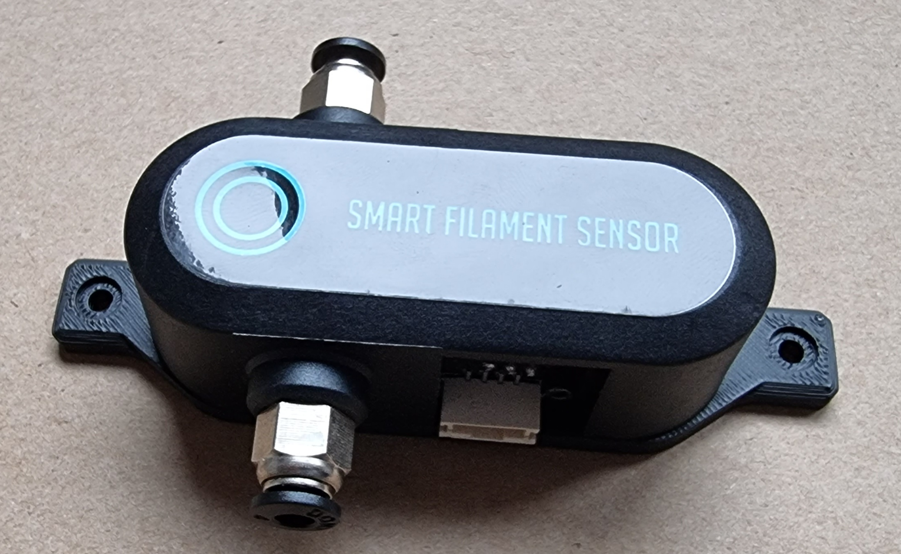
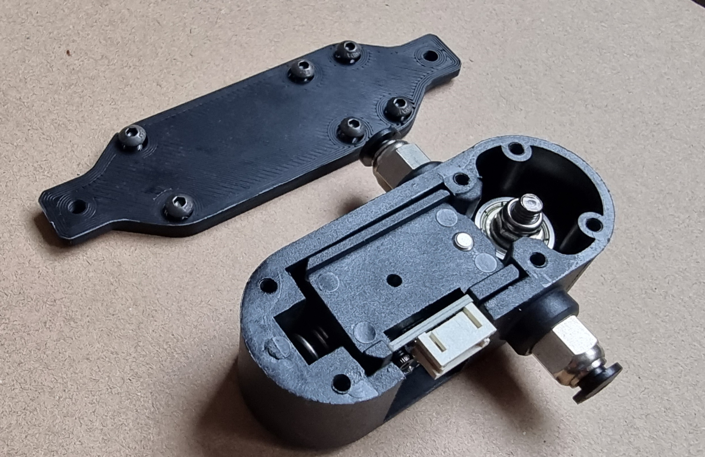
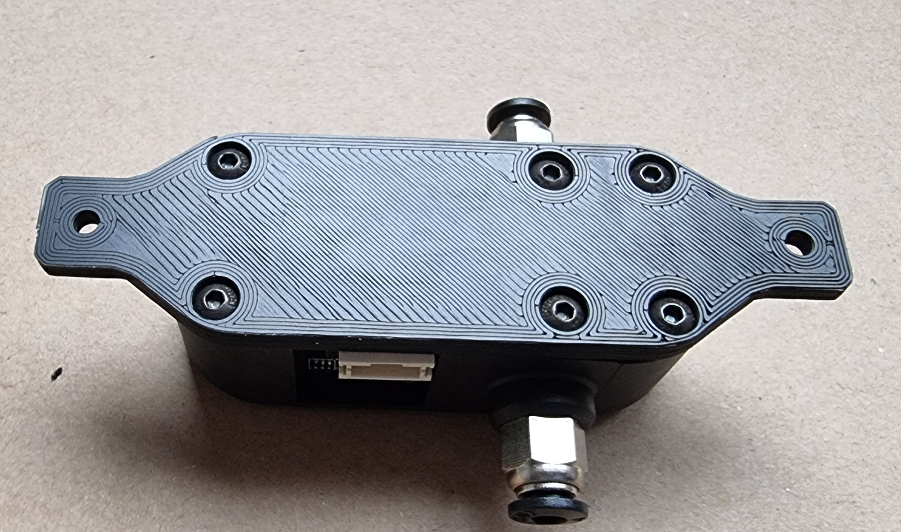
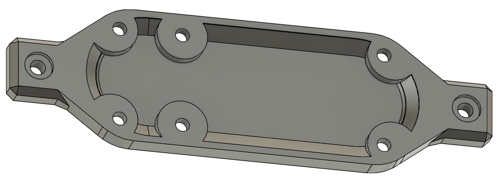

# BTT filament sensor backplate with ears

This backplate provides 2x M3 holes to mount the filament sensor whereever you want to.
In my case, at the back right extrusion of my Voron 0.1
I printed it in eSUN ABS+ with 40% infill so with PETG or PLA you may have to scale it a bit.

[![CC BY-SA 4.0][cc-by-sa-shield]][cc-by-sa]

This work is licensed under a
[Creative Commons Attribution-ShareAlike 4.0 International License][cc-by-sa].

[![CC BY-SA 4.0][cc-by-sa-image]][cc-by-sa]

[cc-by-sa]: http://creativecommons.org/licenses/by-sa/4.0/
[cc-by-sa-image]: https://licensebuttons.net/l/by-sa/4.0/88x31.png
[cc-by-sa-shield]: https://img.shields.io/badge/License-CC%20BY--SA%204.0-lightgrey.svg
