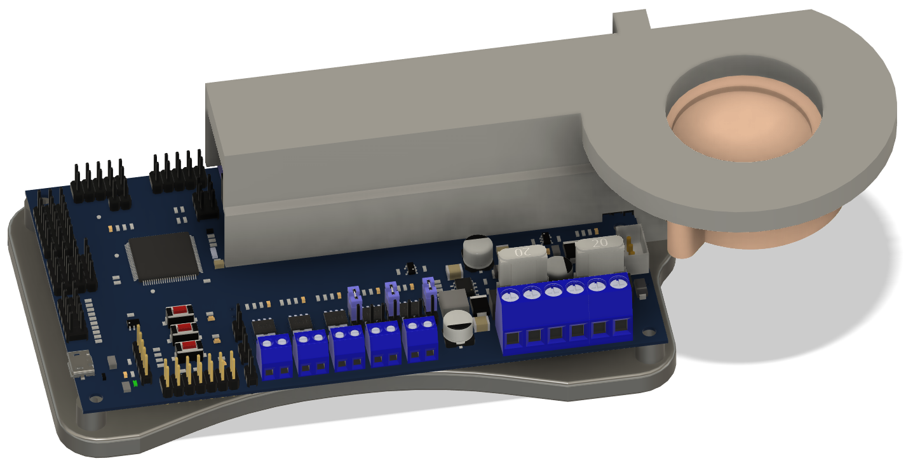
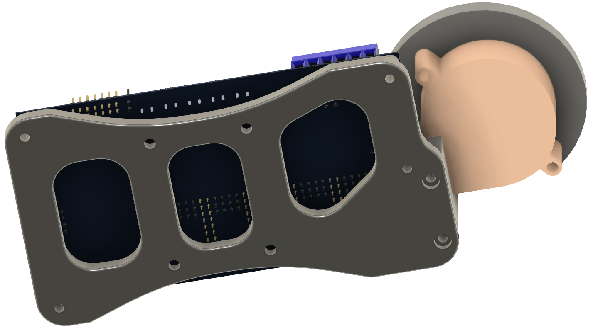
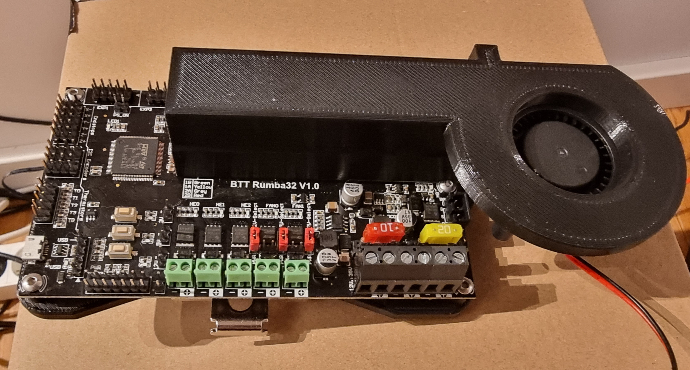
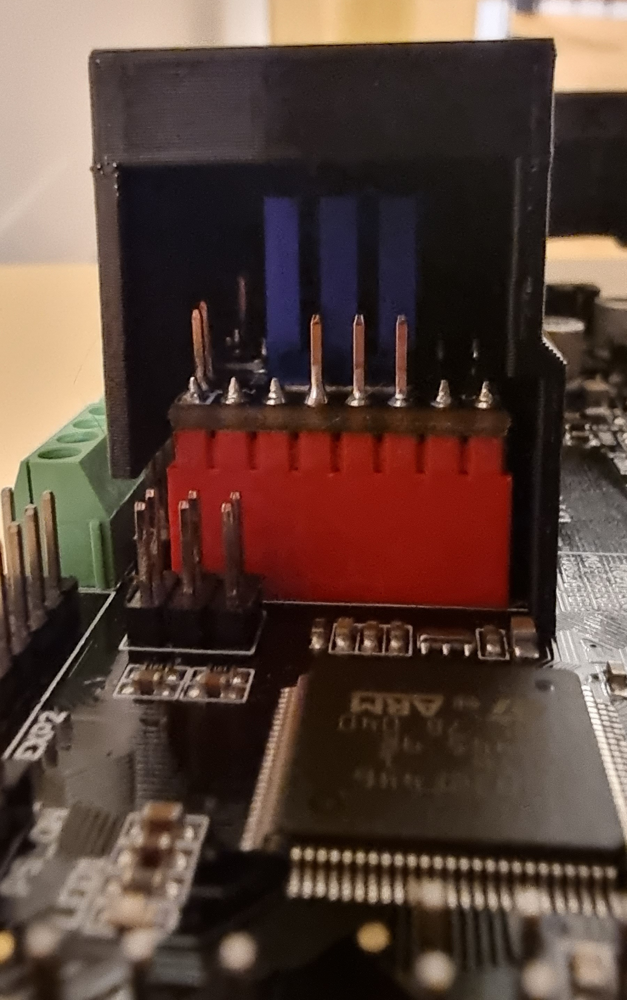
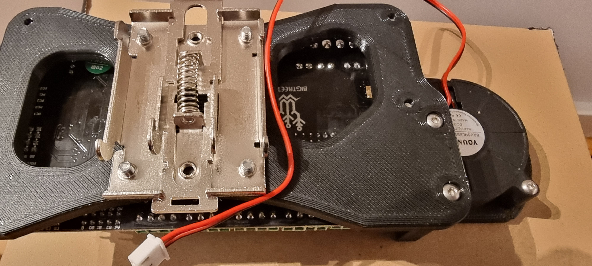

# BTT Rumba32 5015 Cooling Tunnel 
You will need

* 4x M3 Brass heatstake inserts - short M3x5x4 (2x to mount the 5015 fan and 2x to mount the cooling tunnel itself)
* 2x M3x12 BHCS (to mount the tunnel on the DIN mount)
* 2x M3x20 BHCS (to mount the 5015 on the tunnel)
* 4x M3x8 BHCS (to mount the Rumba32 on the DIN mount)
* 4x M4x10 BHCS (to mount the DIN rail SSR clip to the DIN mount)

It prints without supports and of course please put the flat side on the board.
I used PETG, 25% cubic infill and it's pretty difficult to bend it.
Be gentle with the insets and the M3x20 screws, there is not much plastic behind it and if you squeezed in the inserts too fast plastic may have accumulated at the bottom.
All 4 holes in the tunnel are for heatstake inserts.

If you care about noise, you should operate your 5015 fan with 12V or use PWM to keep it silent.

[![CC BY-SA 4.0][cc-by-sa-shield]][cc-by-sa]

This work is licensed under a
[Creative Commons Attribution-ShareAlike 4.0 International License][cc-by-sa].

[![CC BY-SA 4.0][cc-by-sa-image]][cc-by-sa]

[cc-by-sa]: http://creativecommons.org/licenses/by-sa/4.0/
[cc-by-sa-image]: https://licensebuttons.net/l/by-sa/4.0/88x31.png
[cc-by-sa-shield]: https://img.shields.io/badge/License-CC%20BY--SA%204.0-lightgrey.svg
