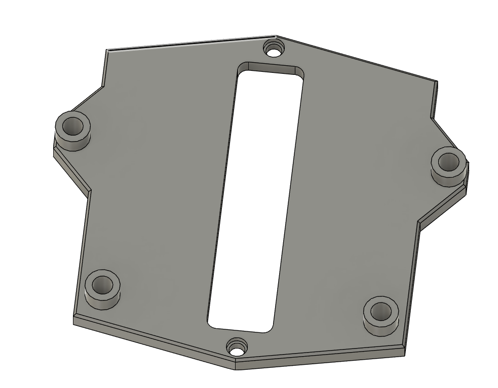

# DC-DC 24V/12V to 5V converter din rail mount
Based on the2 channel relay mount which you can find at https://github.com/VoronDesign/VoronUsers/tree/master/printer_mods/ByteChild/2_Channel_Relay_DIN_Rail_Bracket
I also added the Voron 2 DIN rail clip which is needed for your convenience which you can find at https://github.com/VoronDesign/Voron-2/blob/Voron2.4/STLs/VORON2.4/Electronics_Compartment/DIN_Brackets/pcb_din_clip_x3.stl 

This fits the DC-DC converters which are e.g. part of the Voron 0.1 BOM and sold as "TOBSUN" (do a google search) or similar.
You will need 2x M2x10 self-tapping screws to attach the mount to the pcb din clip and of course M3 screws to attach the DC-DC converter itself.

I don't have a good photo yet, will add that ASAP.

