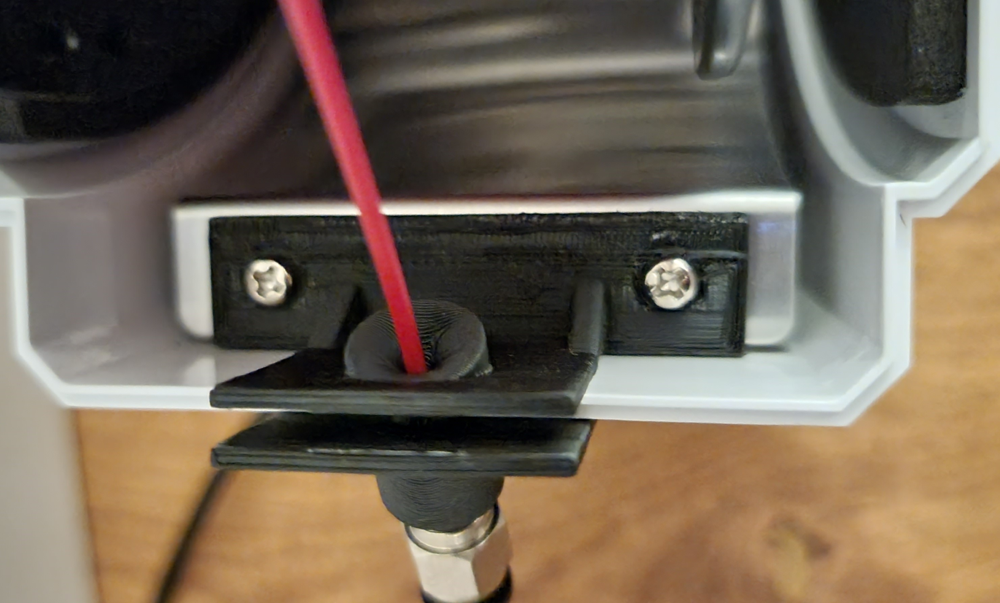
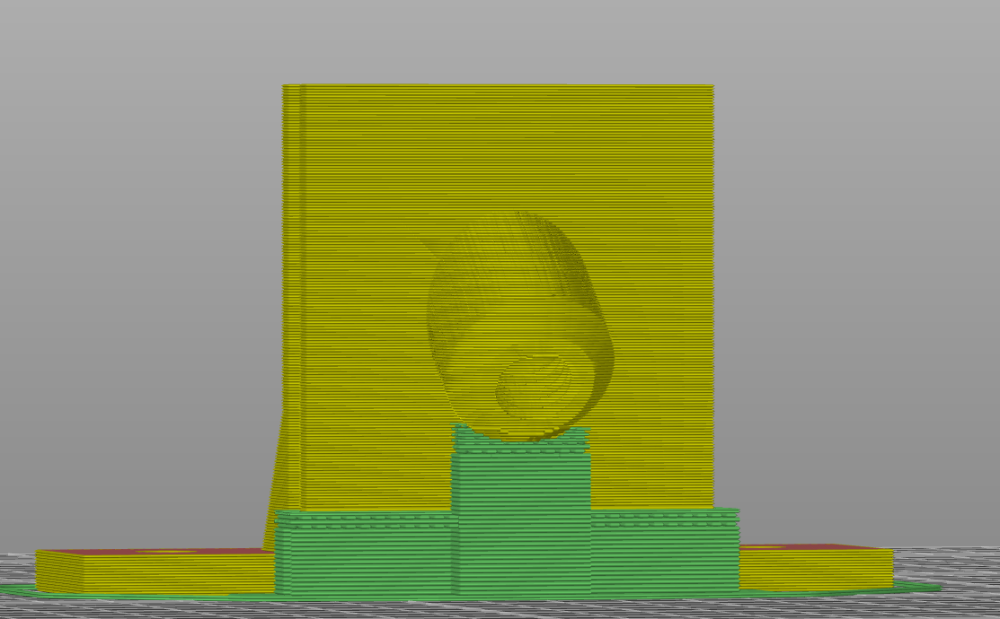
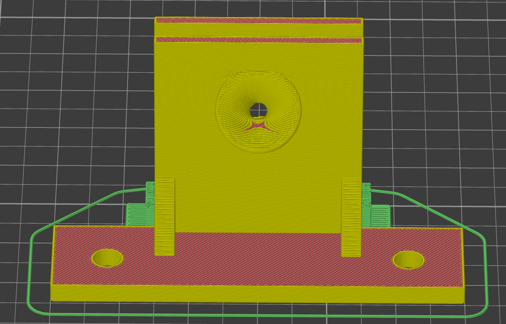

# Filadryer S1 PTFE fitting with screws

I created this because the other PTFE fitting mounts without drilling holes were very flimsy and broke easily.
This allows you to add a M6 PTFE fitting to your box which is very rigid and you just attach it to the existing screws.
The lid of the box can be opened and closed without issues and it's still sealed.

Please print it in ABS or anything else which withstands 60°C or more, PETG may be not sufficient.

You have to print it with supports on the build plate and make sure that there are no supports within the thread as you will never get them out.

No .step this time as it is a mess. The existing mesh https://www.thingiverse.com/thing:4850497 I based this on is very highpoly and has some defects.

[![CC BY-NC-SA 4.0][cc-by-nc-sa-shield]][cc-by-nc-sa]

This work is licensed under a
[Creative Commons Attribution-NonCommercial-ShareAlike 4.0 International License][cc-by-nc-sa].

[![CC BY-NC-SA 4.0][cc-by-nc-sa-image]][cc-by-nc-sa]

[cc-by-nc-sa]: https://creativecommons.org/licenses/by-nc-sa/4.0/
[cc-by-nc-sa-image]: https://licensebuttons.net/l/by-nc-sa/4.0/88x31.png
[cc-by-nc-sa-shield]: https://img.shields.io/badge/License-CC%20BY--NC--SA%204.0-lightgrey.svg
