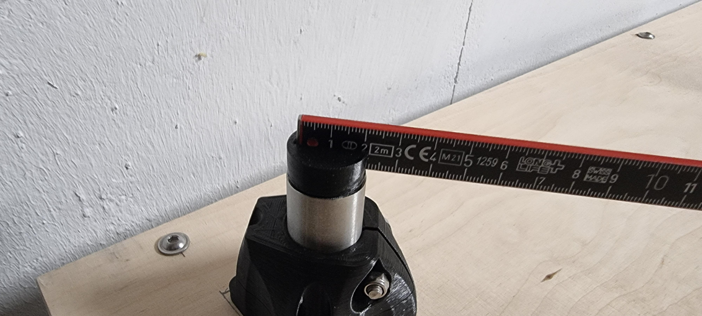
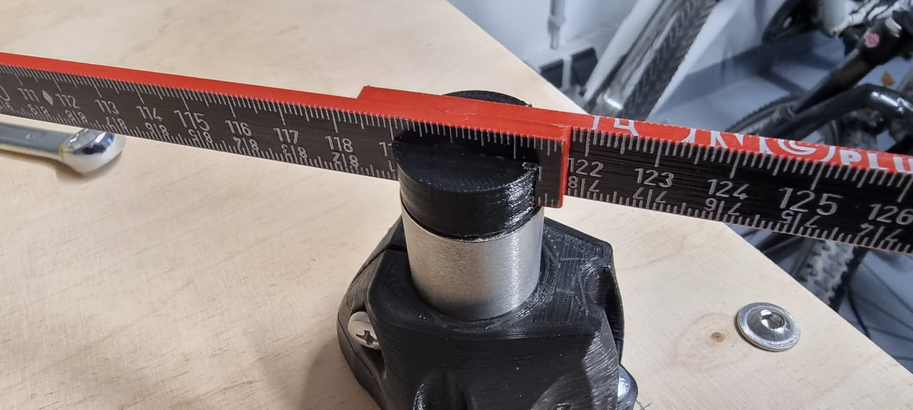

# MPCNC Primo 25mm (Type F) squaring helper

This helps you on getting your MPCNC Primo squared. You will need a folding rule, I used a Wiha Longlife 37067 made out of composite plastic.
You have to adjust the .step that your folding rule sits tight in both helpers and doesn't move without excessive force.
Also you may have to adjust the diameter of the part which slides into the tubes. It shouldn't move however should be removable with minimal force.

Here is how to use this tool:

Use the MPCNC Primo calculator to calculate your table size. You will need both

x table size (outer edges of feet)

and 

y table size (outer edges of feet)

Draw the outer edges of your feet as accurate as possible on your table. 
You should have put the steel tubes already in your feet before continuing.
Put the start helper into a foot and align it as possible at one corner you previously have drawn on the table.
Screw down that first foot.
Then put the folding rule into the start helper (the one where the slot doesn't go fully through)
Put the end helper into a second foot. Don't insert the folding rule yet. Place the second foot in the opposite corner (diagonal) as accurate as possible.
Screw down that second foot.
Insert the folding rule into the second foot. Gently lift both helpers out of the feet. Take care that the ruler doesn't move within the helpers.
Put the remaining feet at their positions as accurate as possible. 
Insert both helpers into the recently positioned feet which are not screwed down yet.
Even though it doesn't matter as the tubes are round and you only care about squareness, you still should try to form a straight rectangle with those two last feet.
If the rectangle is not straight from your viewing angle but it is square, well.... at least you will have accurate cuts ;-)

Before screwing down the last feet fully, do not tighten the screws and put the helpers again on the two feet which are already screwed down.
Compare if you can put the helpers on both diagonals without any force, bending or sliding of the folding rule. If that is the case you have a well aligned MPCNC.

[![CC BY-SA 4.0][cc-by-sa-shield]][cc-by-sa]

This work is licensed under a
[Creative Commons Attribution-ShareAlike 4.0 International License][cc-by-sa].

[![CC BY-SA 4.0][cc-by-sa-image]][cc-by-sa]

[cc-by-sa]: http://creativecommons.org/licenses/by-sa/4.0/
[cc-by-sa-image]: https://licensebuttons.net/l/by-sa/4.0/88x31.png
[cc-by-sa-shield]: https://img.shields.io/badge/License-CC%20BY--SA%204.0-lightgrey.svg
