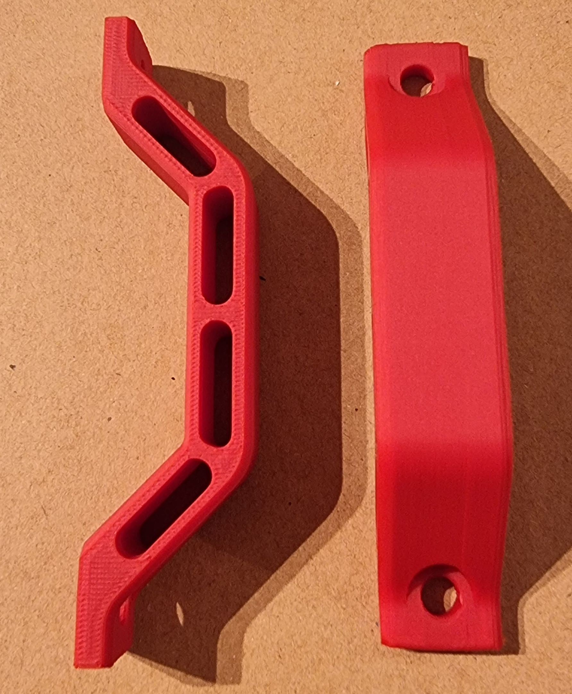
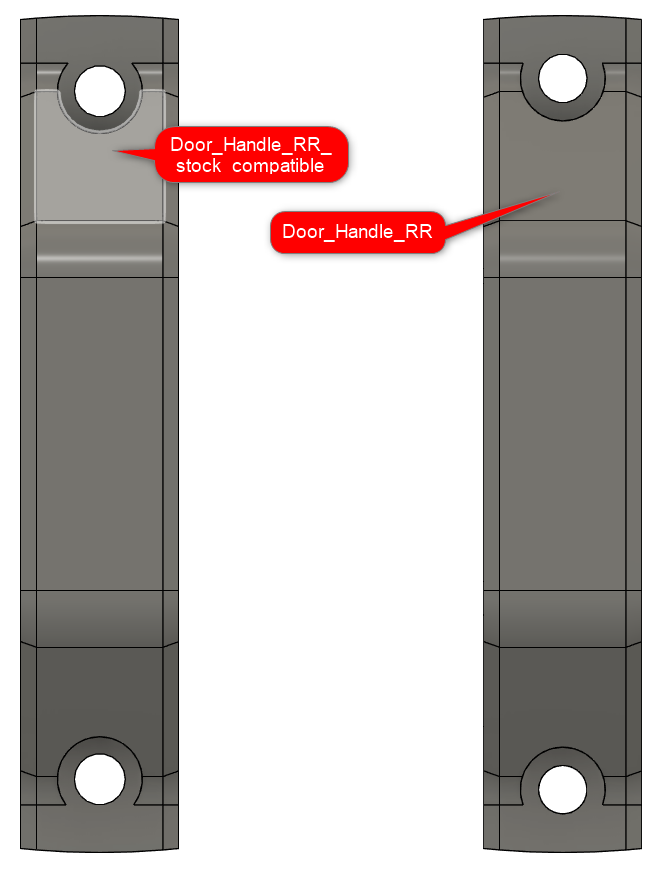
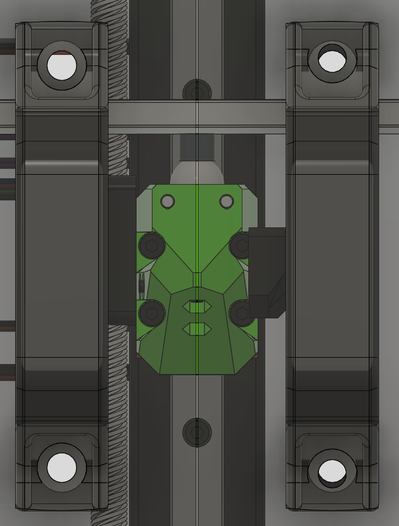

# Voron 0.1 handles compatible with RatRig V-Core 3 Enclosure
These are scaled Voron 0.1 handles where the magnets have been replaced with holes for the regular M5 screws with are also being used for the rest of the build and the stock enclosure Nylon handles.

* 2x M5x12 head cap crews (the part where the screws are is thinner than on the nylon handles, therefore 12mm is sufficient)

I printed them with 40% infill and it should work without a brim as the model doesn't tend to warp.
There are two different variants:

 * Door_Handle_RR_stock_compatible
 
This is using the same hole distance and size than the nylon handles RR ships with the enclosure.
As I don't own an enclosure yet, I used the official RR CAD data so lets hope that it matches.
If in doubt or you have panels already, please use this variant.

  * Door_Handle_RR
  
This is using slightly smaller holes and the distance between them is a bit larger. Not much but it looks nicer and will give a bit more stability.
However that means it won't fit the regular panels if you don't also adapt the holes there.

[![GPLv3 License][gpl-v3-shield]][gpl-v3]

This work is licensed under the
[GPLv3 License][gpl-v3] license.

[gpl-v3]: https://www.gnu.org/licenses/gpl-3.0.txt
[gpl-v3-shield]: https://img.shields.io/badge/License-GPLv3-lightgrey.svg
