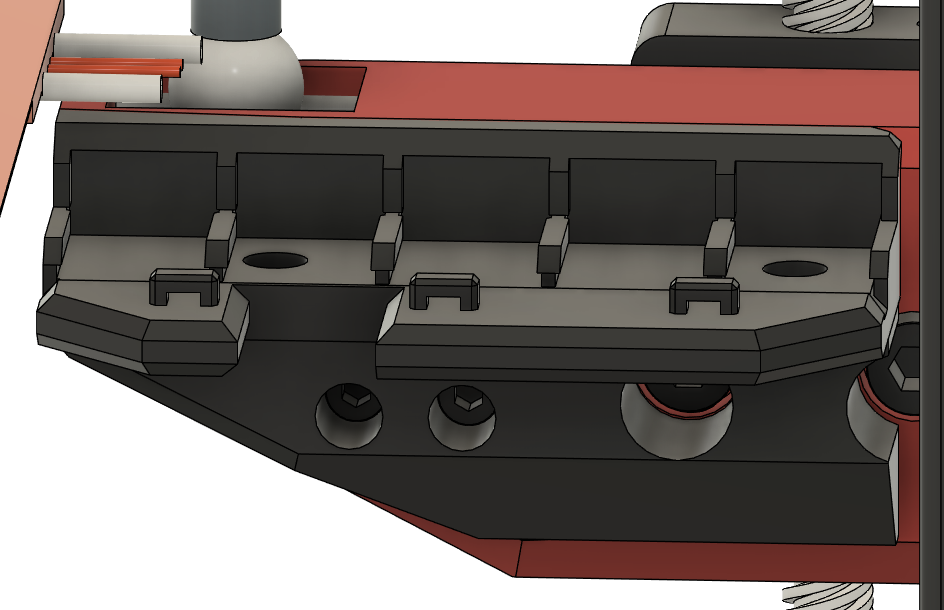
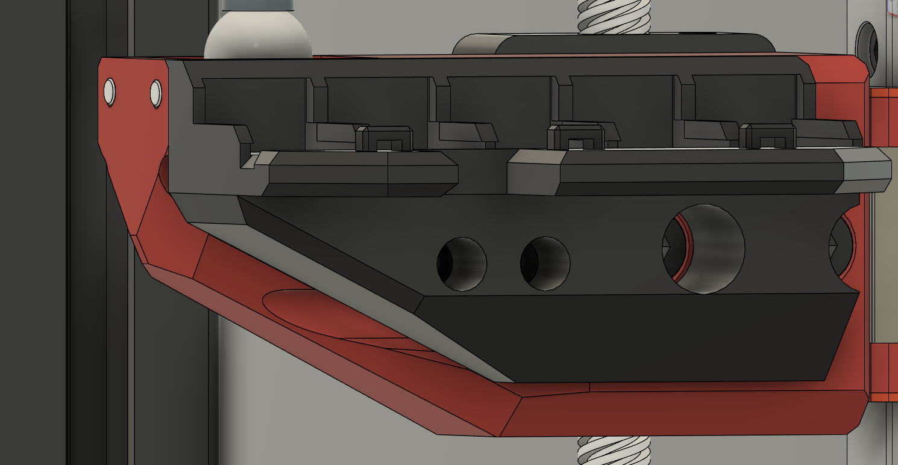
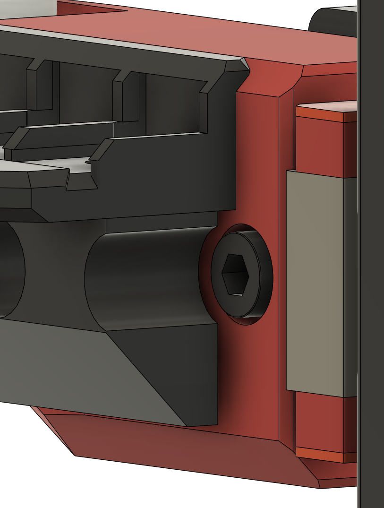
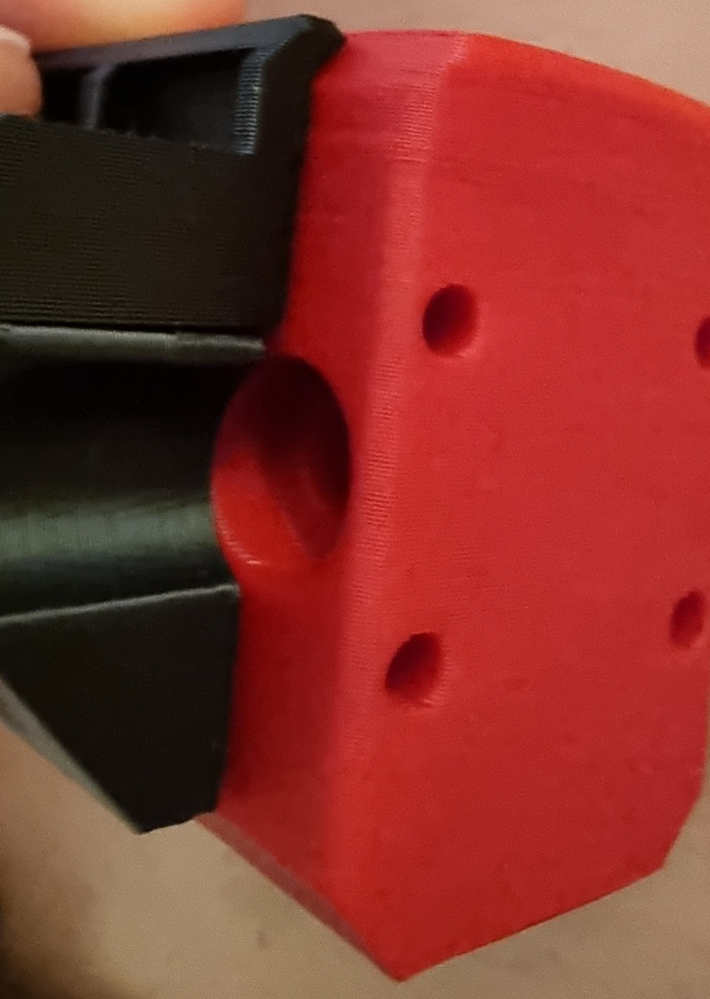
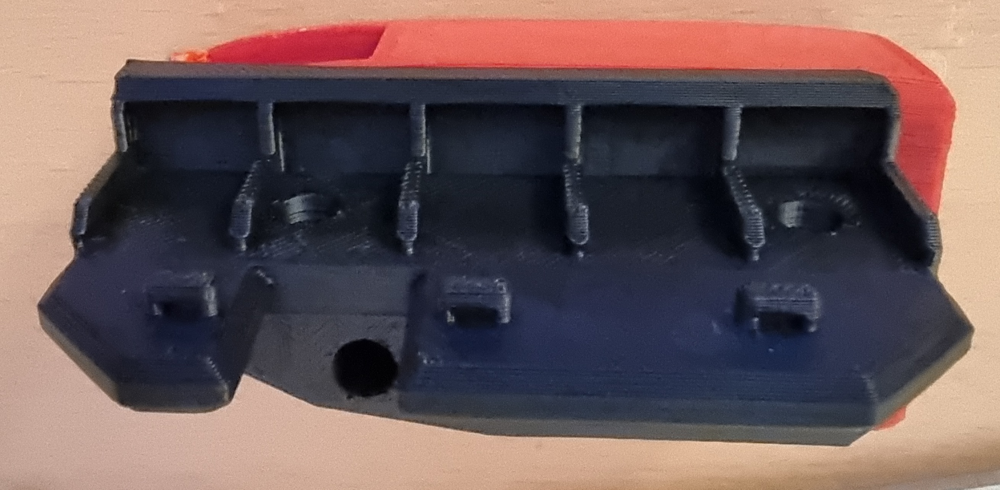

# V-Core 3 rear Z arm 5x Wago 221-415 mount and drag chain mount

***TLDR; UNPLUG YOUR PRINTER BEFORE DOING ANYTHING ON MAINS VOLTAGE. OTHERWISE THERE IS A 50% CHANCE YOU WILL GET SHOCKED.***
* Even if your printer is switched off, it only may have switched neutral which means you still have a hot phase even if DC-powered items like the printer board or RPI are definitely off. 
*You never know without measuring if it is safe to work on mains powered stuff in your printer and it is way faster to pull the power cord instead of measuring using e.g. a DUSPOL.*

The wago mounts are based on the Voron V2 / 2020 mounts by Boingomw which you can find at https://github.com/boingomw/VoronUsers/tree/master/printer_mods/Boingomw/Wago_mount
The drag chain mount is based on the one by jouz which you can find at https://www.thingiverse.com/thing:4961003

The drag chain mount holes are for a IGUS 05.10.038.0 / connection set 050.10.12.A1.
You will need to modify this for different drag chains. Also you will need 
* 2x M3 Brass heatstake inserts - short M3x5x4

Both wago and drag chain mount are designed fit exactly on the arm. It won't fit Ventermechs or maybe other modifications you may have done.
Please print in ABS to make sure it will withstand the heat of the bed. PETG may be sufficient but that is something you don't want to try.
The Wago clamps are rated for 85°C environment temperature and 105°C permanent usage temperature so these won't fail.
Print without supports and you won't need much infill.

[![GPLv3 License][gpl-v3-shield]][gpl-v3]

This work is licensed under the
[GPLv3 License][gpl-v3] license.

[gpl-v3]: https://www.gnu.org/licenses/gpl-3.0.txt
[gpl-v3-shield]: https://img.shields.io/badge/License-GPLv3-lightgrey.svg

