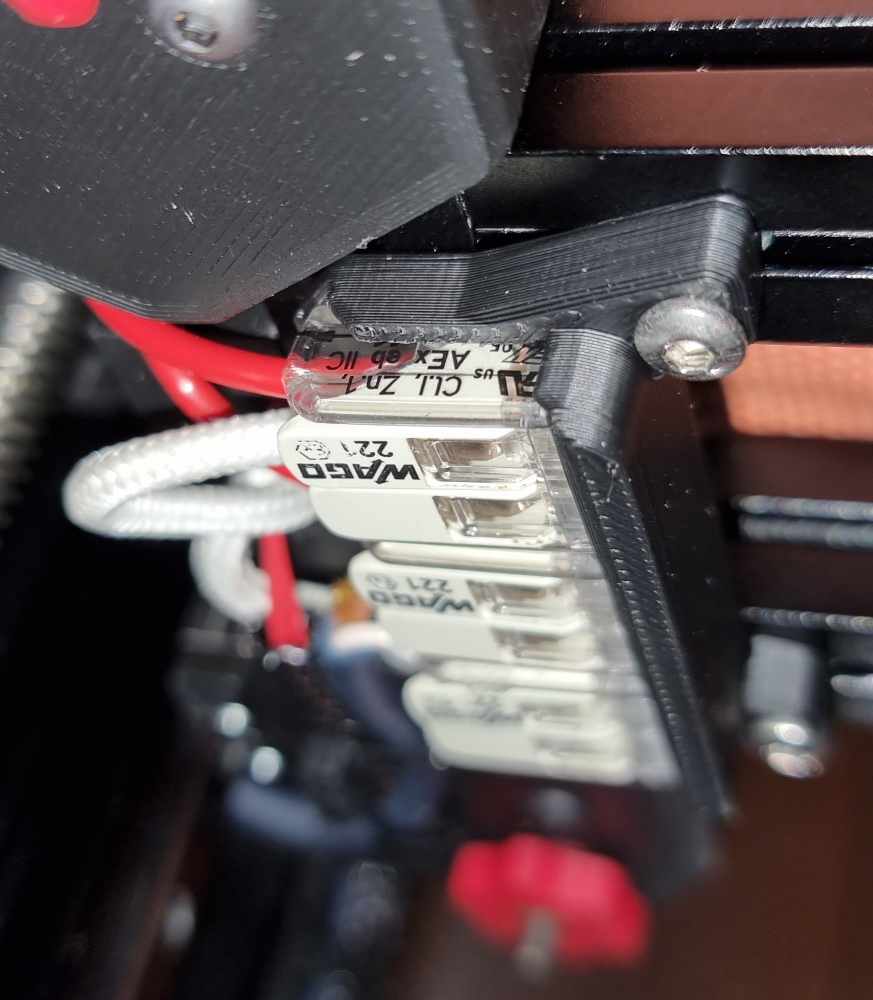
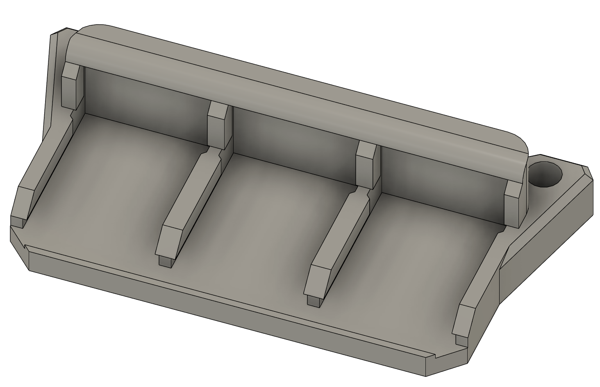

# Voron V0.1 3x Wago 221-412 mount for the bed heater
Based on the Voron V2 / 2020 mounts by Boingomw which you can find at https://github.com/boingomw/VoronUsers/tree/master/printer_mods/Boingomw/Wago_mount

Use 2x M3x8 SHCS to secure them. Unfortunately you will also need M3 nuts in your bed extrusions. 
I ordered Wago Ex instead of the regular Wagos because they're white. And they're more useful in case you printer tends to explode.

Initially I printed them in PETG and it worked fine for 100h of printing. Then I exchanged them against ABS+ printed ones, the PETG variant survived without issues though.

Unfortunately none of the creators added a license however as they were in VoronUsers I took GPLv3.

